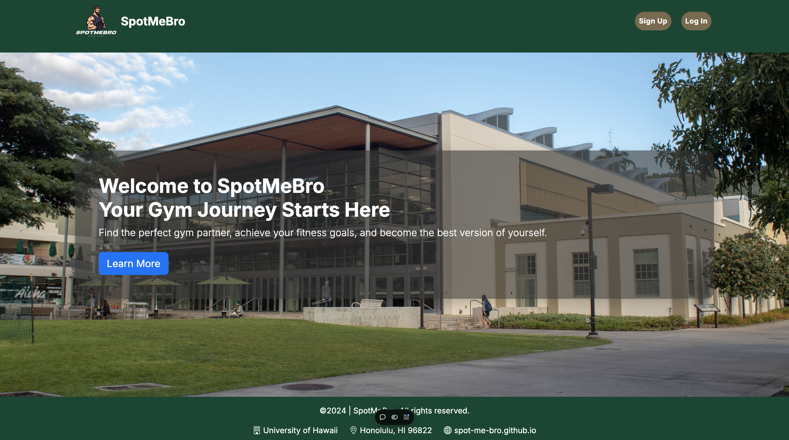
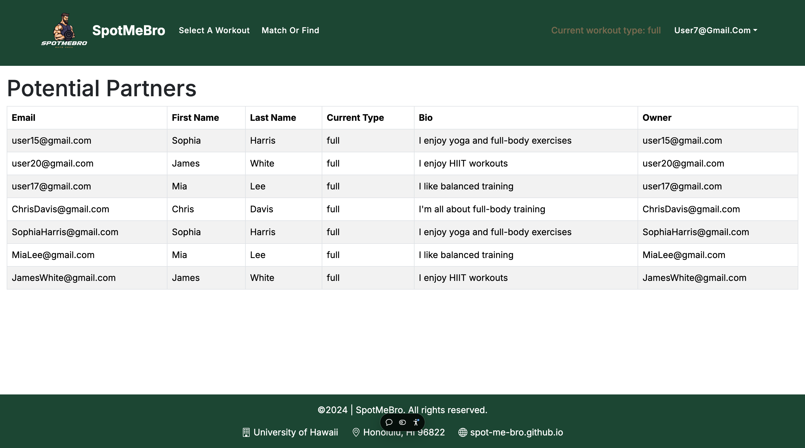
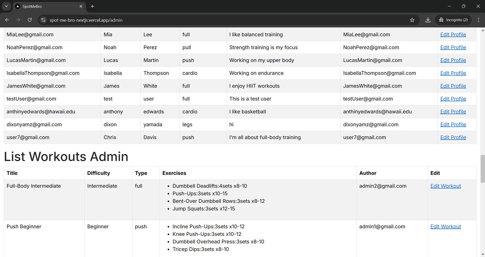

SpotMeBro is a web application designed to match users together to find workout partners. Additionally the app has a database of workouts managed by administrators that correspond to the style of workout the user selects. My contribution was widely spread, the majority of the time I was working on backend issues with our schema, figuring out how to properly get information into and out of our database and generally fixing issues that would arise. 

Here is the landing page:

Here is the list partners page, once a user has logged in and selected a type of workout they get presented with other users who have the same type in their profile:

Here is the admin page where admins can edit profiles and workouts:

If you would like to see the source code and try the app out yourself, here is the organization's  <a href="https://github.com/spot-me-bro"><i class="large github icon "></i>github page:</a>
